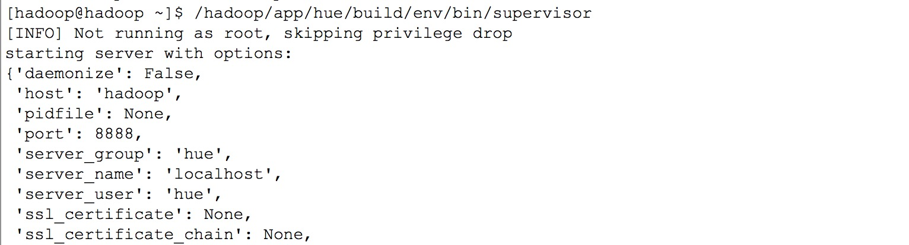
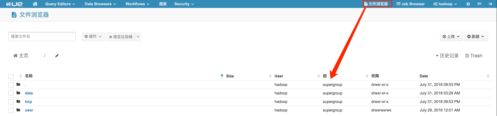
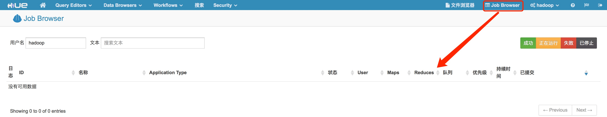
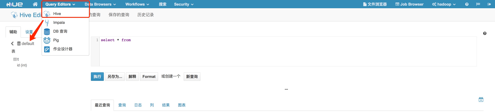
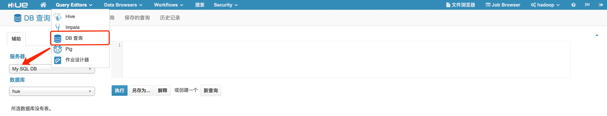

Hue学习笔记
- 软件下载安装
```
[hadoop@hadoop soft]$ wget http://archive.cloudera.com/cdh5/cdh/5/hue-3.9.0-cdh5.7.0.tar.gz
[hadoop@hadoop soft]$ tar -xzvf hue-3.9.0-cdh5.7.0.tar.gz
[hadoop@hadoop soft]$ mv hue-3.9.0-cdh5.7.0.tar.gz hue 
[hadoop@hadoop soft]$ mv hue/ ../app
[root@hadoop ~]# yum -y install gcc libxml2-devel cyrus-sasl-devel cyrus-sasl-gssapi \
mysql-devel python-setuptools ant libsasl2-dev libsasl2-modules-gssapi-mit \
libkrb5-dev libtidy-0.99-0 openldap-dev libldap2-dev python-devel openssl-devel libxslt-devel gmp-devel \
sqlite-devel openldap-devel build-essential gcc-c++ libtidy cyrus-sasl-plain
[hadoop@hadoop hue]$ make apps
[hadoop@hadoop hue]$ chmod 755 ../app/hue -R
```
- 软件配置测试
```
[hadoop@hadoop hue]$ cp ./desktop/conf/hue.ini ./desktop/conf/hue.ini.bak
[hadoop@hadoop hue]$ vi ./desktop/conf/hue.ini
  # Set this to a random string, the longer the better.
  # This is used for secure hashing in the session store.
  secret_key=jFE93j;2[290-eiw.KEiwN2s3['d;/.q[eIW^y#e=+Iei*@Mn<qW5o
  
  # Webserver listens on this address and port
  http_host=hadoop
  http_port=8888
  
  # Time zone name
  time_zone=Asia/Shanghai
  # This should be the hadoop cluster admin
  default_hdfs_superuser=hadoop

[hadoop@hadoop hue]$ ./build/env/bin/supervisors
```

```
[hadoop@hadoop hue]$ vi /hadoop/app/hadoop/etc/hadoop/core-site.conf
<property>
    <name>hadoop.proxyuser.hue.hosts</name>
    <value>*</value>
</property>
<property>
    <name>hadoop.proxyuser.hue.groups</name>
    <value>*</value>
</property>
[hadoop@hadoop hue]$ vi /hadoop/app/hadoop/etc/hadoop/hdfs-site.conf
<property> 
    <name>dfs.webhdfs.enabled</name> 
    <value>true</value> 
</property>
[hadoop@hadoop hue]$ vi ./desktop/conf/hue.ini
 # Configuration for HDFS NameNode
  # ------------------------------------------------------------------------
  [[hdfs_clusters]]
    # HA support by using HttpFs

    [[[default]]]
      # Enter the filesystem uri
      fs_defaultfs=hdfs://hadoop:8020

      # NameNode logical name.
      ## logical_name=

      # Use WebHdfs/HttpFs as the communication mechanism.
      # Domain should be the NameNode or HttpFs host.
      # Default port is 14000 for HttpFs.
      webhdfs_url=http://hadoop:50070/webhdfs/v1

      # Change this if your HDFS cluster is Kerberos-secured
      ## security_enabled=false

      # In secure mode (HTTPS), if SSL certificates from YARN Rest APIs
      # have to be verified against certificate authority
      ## ssl_cert_ca_verify=True

      # Directory of the Hadoop configuration
      hadoop_conf_dir=/hadoop/app/hadoop/etc/hadoop
      hadoop_hdfs_home=/hadoop/app/hadoop
      hadoop_bin=/hadoop/app/hadoop/bin
[hadoop@hadoop hue]$ /hadoop/app/hadoop/sbin/start-all.sh
[hadoop@hadoop hue]$ ./build/env/bin/supervisors
```

```
[hadoop@hadoop hue]$ vi ./desktop/conf/hue.ini
# Configuration for YARN (MR2)
  # ------------------------------------------------------------------------
  [[yarn_clusters]]

    [[[default]]]
      # Enter the host on which you are running the ResourceManager
      resourcemanager_host=hadoop

      # The port where the ResourceManager IPC listens on
      resourcemanager_port=8032

      # Whether to submit jobs to this cluster
      submit_to=True

      # Resource Manager logical name (required for HA)
      ## logical_name=

      # Change this if your YARN cluster is Kerberos-secured
      ## security_enabled=false

      # URL of the ResourceManager API
      resourcemanager_api_url=http://hadoop:8088

      # URL of the ProxyServer API
      proxy_api_url=http://hadoop:8088

      # URL of the HistoryServer API
      history_server_api_url=http://hadoop:19888
[hadoop@hadoop hue]$ ./build/env/bin/supervisors
```

```
[hadoop@hadoop hue]$ vi ./desktop/conf/hue.ini
[beeswax]

  # Host where HiveServer2 is running.
  # If Kerberos security is enabled, use fully-qualified domain name (FQDN).
  hive_server_host=hadoop

  # Port where HiveServer2 Thrift server runs on.
  hive_server_port=10000

  # Hive configuration directory, where hive-site.xml is located
  hive_conf_dir=/hadoop/app/hive/conf
  hive_home_dir=/hadoop/app/hive
[hadoop@hadoop hue]$ /hadoop/app/hive/bin/hive --service metastore &
[hadoop@hadoop hue]$ /hadoop/app/hive/bin/hive --service hiveserver2 &
[hadoop@hadoop hue]$ ./build/env/bin/supervisors
```

```
[hadoop@hadoop hue]$ vi ./desktop/conf/hue.ini
[[[mysql]]]
  # Name to show in the UI.
  nice_name="My SQL DB"

  # For MySQL and PostgreSQL, name is the name of the database.
  # For Oracle, Name is instance of the Oracle server. For express edition
  # this is 'xe' by default.
  name=hue

  # Database backend to use. This can be:
  # 1. mysql
  # 2. postgresql
  # 3. oracle
  engine=mysql

  # IP or hostname of the database to connect to.
  host=localhost

  # Port the database server is listening to. Defaults are:
  # 1. MySQL: 3306
  # 2. PostgreSQL: 5432
  # 3. Oracle Express Edition: 1521
  port=3306

  # Username to authenticate with when connecting to the database.
  user=root

  # Password matching the username to authenticate with when
  # connecting to the database.
  password=password
[root@hadoop ~]# ln -s /hadoop/app/mysql/data/mysql.sock /var/lib/mysql/mysql.sock
[hadoop@hadoop hue]$ ./build/env/bin/supervisors
```
